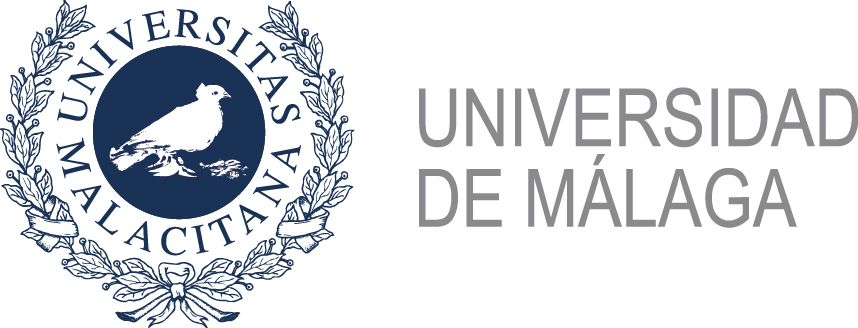

# Fault-Tolerant Algoritms

En estos notebooks veremos una serie de algoritmos conocidos como "Fault-Tolerant". Este nombre hace referencia a que para que estos algortimos funcionen, necesitariamos ejecutarlos en un ordenador cuántico tolerante a fallos. Los algoritmos más conocidos de este estilo son el de Shor y el de Grover.


```{tableofcontents}
```

%```{toctree}
%:caption: Table of Contents
%:name: mastertoc
%:glob:
%*
%```

Autores:
- David Castaño ([UMA-SCBI](https://www.scbi.uma.es/site/)), Raul Fuentes ([BSC-CNS](https://www.bsc.es/es)), Daniel Talaván  ([cenits](https://www.cenits.es/)), Francisco Matanza ([UNICAN](https://web.unican.es/))





---
<figure><center>

</center></figure>

<center>
<a rel="license" href="http://creativecommons.org/licenses/by-sa/4.0/">
</a>
</center>

License: <a rel="license" href="http://creativecommons.org/licenses/by-sa/4.0/">Licencia Creative Commons Atribución-CompartirIgual 4.0 Internacional</a>.

This work has been financially supported by the Ministry for Digital Transformation and of Civil Service of the Spanish Government through the QUANTUM ENIA project call - Quantum Spain project, and by the European Union through the Recovery, Transformation and Resilience Plan - NextGenerationEU within the framework of the Digital Spain 2026 Agenda.

<center>

</center>